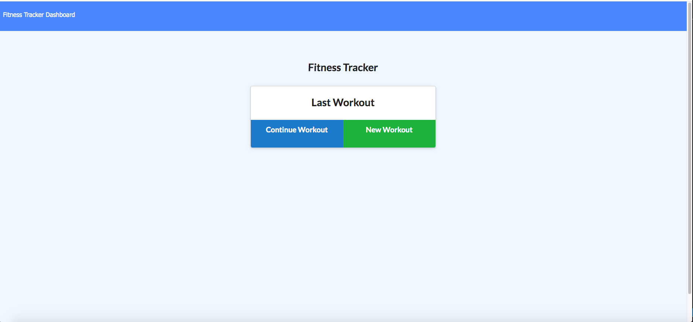

# Fitness Tracker

## Description:

Dynamic app for tracking your past and current workouts. Save reps or sets of cardio or weight exercises to the Mongo database so you can see your last workout when you load the app. Whatever exercise you want! Just type it in and save your reps and sets.

## Table of Contents:
- [installation](#installation)
- [usage](#usage)
- [contribution](#contribution)
- [licenses](#licenses)
- [test](#test)
- [contact](#contact)

## Installation:
Clone the repo and run "npm i" to install the dependencies from package-json. Connect your mongo database to your server either locally or with a server service online. Run the "create heroku" to create a heroku app and then run heroku open to open the app in your browser.

## Usage:
For avid exercisers who want to save and track their past and current workouts

## Contribution:
If you have any contributions or tips to improve the app please use the contact info below and reach out!

## Licenses:

    This is free and unencumbered software released into the public domain.

    Anyone is free to copy, modify, publish, use, compile, sell, or
    distribute this software, either in source code form or as a compiled
    binary, for any purpose, commercial or non - commercial, and by any
    means.

    In jurisdictions that recognize copyright laws, the author or authors
    of this software dedicate any and all copyright interest in the
    software to the public domain.We make this dedication for the benefit
    of the public at large and to the detriment of our heirs and
    successors.We intend this dedication to be an overt act of
    relinquishment in perpetuity of all present and future rights to this
    software under copyright law.

    THE SOFTWARE IS PROVIDED "AS IS", WITHOUT WARRANTY OF ANY KIND,
    EXPRESS OR IMPLIED, INCLUDING BUT NOT LIMITED TO THE WARRANTIES OF
    MERCHANTABILITY, FITNESS FOR A PARTICULAR PURPOSE AND NONINFRINGEMENT.
    IN NO EVENT SHALL THE AUTHORS BE LIABLE FOR ANY CLAIM, DAMAGES OR
    OTHER LIABILITY, WHETHER IN AN ACTION OF CONTRACT, TORT OR OTHERWISE,
    ARISING FROM, OUT OF OR IN CONNECTION WITH THE SOFTWARE OR THE USE OR
    OTHER DEALINGS IN THE SOFTWARE.

    For more information, please refer to < https://unlicense.org>

## Test:
npm test

## Contact:

GitHub: https://github.com/behrenskarl

Email: behrens.karl@gmail.com